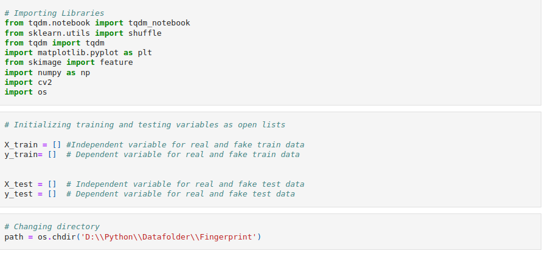

# Fingerprint Spoof Detection System Report

## Model

This task involved building a fingerprint spoof detection system that would help differentiate and detect a real and a fake fingerprint.
With the help of open-source computer vision (OpenCV), local binary pattern (LBP), and support vector machine (SVM) among other Python modules.
The system was successfully developed to identify and recognize fake and authentic fingerprints from a biometric system.
The dataset used for this task was provided by the instructor.
There were four datasets provided: real and fake training datasets, real and fake testing datasets.
On successful development of the system, the model was able to differentiate between an authentic and a spoof fingerprint with an accuracy of 84.17%.

## Procedure and Results of the Model

- The first phase involved extracting and changing the image data to an array that can be understood and processed by the machine.
  This mainly involved using the OpenCV to read the image and LBP to extract integer values that were a representation of the image in the form of an array.

- The second phase involved training the model from the data gathered from in the first phase.

In this phase, a linear support vector classifier algorithm was used to train the model.
After successful training and prediction, the model achieved an 84.17% accuracy score.
That is, the model was able to predict correctly more than 80% of the data given.
Conclusively, the objective of the assignment was attained as described in this report as well as in the code.
